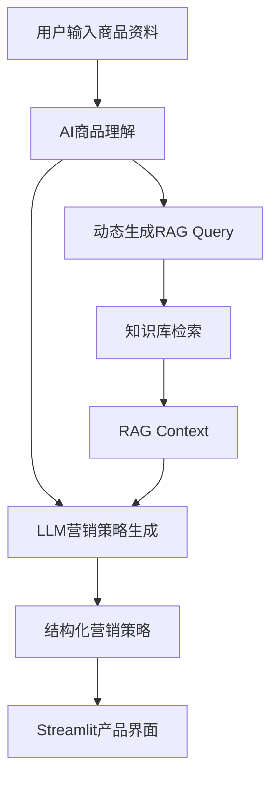

# AI 服装营销策略助手

> 面向服装电商运营人员的 AI 营销策略辅助工具，通过商品理解、动态 RAG 知识增强与大模型生成，将商品资料转化为结构化营销策略。

**项目角色：AI 产品经理 / 项目负责人**

- 在线 Demo：TODO
- GitHub：TODO

当前尚未发布正式的 GitHub 仓库地址或 Streamlit 在线 Demo 地址。

## 项目背景

服装电商营销方案通常需要连续分析商品、卖点、目标人群、使用场景、用户需求、消费者价值、营销方向、渠道、内容与执行动作。传统方式往往需要较多人工整理，并依赖运营人员对商品和平台规则的经验。

在引入大模型后，仍需要关注几个实际问题：模型可能生成泛化策略；商品事实与营销表达可能脱节；历史案例可能被不恰当地迁移；商品未确认的属性也可能被模型虚构。因此，本项目将商品事实、可复用营销方法、历史案例和平台规范拆分处理，并通过 RAG 为策略生成提供可追溯的知识上下文。

## 产品定位

> 面向服装电商运营人员的 AI 营销策略辅助工具。

### 目标用户

- 服装电商运营人员
- 商品运营人员
- 内容营销人员
- 品牌营销人员

### 核心价值

帮助用户将商品资料快速转化为结构化营销策略，减少从商品信息整理到营销方案初稿之间的重复工作，并让策略生成过程能够参考项目内的营销知识与风险规范。

## 核心功能

### 1. 商品资料输入

用户可输入：

- 品牌名称
- 商品名称
- 商品类型
- 已确认商品卖点
- 使用场景
- 商品详细资料

### 2. AI 商品理解

AI 对当前商品进行：

- 商品信息理解
- 核心卖点分析
- 目标人群分析
- 使用场景分析
- 用户需求分析
- 消费者价值分析

当前商品资料属于动态业务输入，不作为固定知识库内容。

### 3. RAG 知识增强

知识库包含：

- 品牌资料
- 营销方法
- 历史营销案例
- 电商内容规范
- 营销风险表达

系统根据商品理解结果动态生成 RAG Query，再从 Chroma 向量库中检索相关知识，形成供后续生成使用的上下文。

### 4. 营销策略生成

系统输出 11 个结构化模块：

1. 商品定位
2. 核心卖点
3. 目标人群
4. 使用场景
5. 用户需求
6. 消费者价值
7. 核心营销方向
8. 渠道策略
9. 内容方向
10. 执行建议
11. 风险控制

## 产品流程



## AI 产品设计思路

### 从商品事实出发

商品分析先处理用户输入的商品资料，再将确认的商品事实传递给后续查询和策略生成环节，避免把知识库中的通用经验误当成当前商品事实。

### 动态构造检索问题

RAG Query 由当前商品理解结果动态生成，不使用单一固定查询，以便让检索结果同时关注商品特征、目标人群、场景和营销任务。

### 结构化输出与风险边界

策略使用固定字段组织，便于运营人员阅读和后续评估；风险控制模块用于约束未经商品资料确认的功效、承诺和营销表达。RAG 提供参考依据，但不替代运营人员对商品事实和最终文案的审核。

## 技术架构

```text
Streamlit
    ↓
商品输入与展示层
    ↓
AI 商品理解（OpenAI-compatible LLM）
    ↓
动态 RAG Query
    ↓
Embedding + Chroma 检索
    ↓
RAG Context 组装
    ↓
结构化营销策略生成
```

## RAG 知识库

知识库按用途划分为四类：

- `brand/`：品牌资料
- `marketing_rules/`：营销方法与流程
- `marketing_cases/`：历史营销案例
- `platform_rules/`：平台内容规范与风险表达

当前知识库包含 9 个知识文档。AAA 品牌资料和案例为 Demo / 模拟数据，不代表真实客户、真实公司机密或真实业务数据。

## 项目验证

当前项目保留了功能测试、RAG 对比、多商品泛化、风险控制和人工评价实验，已记录的验证信息包括：

- 9 个知识文档、37 个向量 Chunk
- 使用 `qwen3.7-text-embedding` 与 Chroma
- Top 10 → Top 5 检索策略
- 3 类商品泛化验证
- 11 个营销策略字段
- RAG 与无 RAG 方案产生了可观察的策略差异（A/B 记录为 10/11 字段有差异）
- 7/7 事实边界测试通过
- 8 维人工评价框架

这些结果是项目实验记录，不代表真实业务效果、线上用户规模或转化指标；“产生策略差异”也不等同于“提升营销效果”。

## 技术栈

- Python
- Streamlit
- LangChain
- OpenAI-compatible LLM
- Embedding
- Chroma
- Pydantic
- python-dotenv
- 阿里云百炼 OpenAI-compatible API

## 本地运行

1. 安装依赖：

   ```bash
   pip install -r requirements.txt
   ```

2. 复制 `.env.example` 为 `.env`，填写本地 API、模型和 Embedding 配置。不要将 `.env` 提交到 GitHub。
3. 根据 `knowledge_base/` 重新构建本地 Chroma 向量库。构建脚本位于 `scripts/vector_store_builder.py`。
4. 启动 Streamlit：

   ```bash
   streamlit run app/streamlit_app.py
   ```

实际部署时，向量库属于本地运行产物；README 只描述重建流程，不提交 `vector_store/marketing_strategy_kb/` 中的 Chroma 数据文件。

## 项目结构

```text
app/
├─ streamlit_app.py                 # Streamlit 正式入口
├─ product_analyzer.py              # AI 商品理解
├─ marketing_strategy_workflow.py   # 主流程与 RAG 检索
├─ marketing_strategy_generator.py  # 结构化策略生成
├─ vector_store.py                  # Embedding 与向量检索支持
├─ knowledge_loader.py              # 知识库加载与切分
├─ rag_context.py                   # RAG 上下文组装
├─ rag_explanation.py                # 检索结果解释
├─ strategy_traceability.py         # 策略参考溯源
└─ evaluation_metrics.py            # 评估指标支持
knowledge_base/                     # AAA 模拟知识库
tests/                              # 功能与风险控制测试
experiments/                        # RAG、多商品和人工评价实验
scripts/                            # 向量库构建与迁移脚本
vector_store/                       # 本地 Chroma 运行产物目录
screenshots/                        # Demo 截图目录
```

## 项目角色

**AI 产品经理 / 项目负责人**

主要负责：

- 产品需求分析
- 产品定位
- 产品流程设计
- AI 能力设计
- RAG 知识库设计
- 检索策略优化
- AI 风险控制
- 效果评估
- MVP 落地

工程实现使用 Codex 辅助完成。

## 项目边界与安全说明

- 当前项目面向求职展示和 Demo 演示，不代表已上线的生产系统。
- AAA 为模拟服装品牌，项目不包含真实客户、真实业务指标或线上用户数据。
- API Key、Token 等敏感信息只通过环境变量提供，不应写入代码或提交到 GitHub。
- `vector_store/marketing_strategy_kb/` 是可由知识库重新构建的运行产物，默认不提交。
- RAG 检索结果和大模型输出仍需人工审核，尤其是商品功效、质量承诺和平台合规表达。

## 后续计划

- 补充真实 Streamlit Demo 截图
- 完成 Streamlit 在线 Demo 部署
- 补充线上 Demo 链接和 GitHub 仓库链接
- 继续完善测试目录与实验报告
